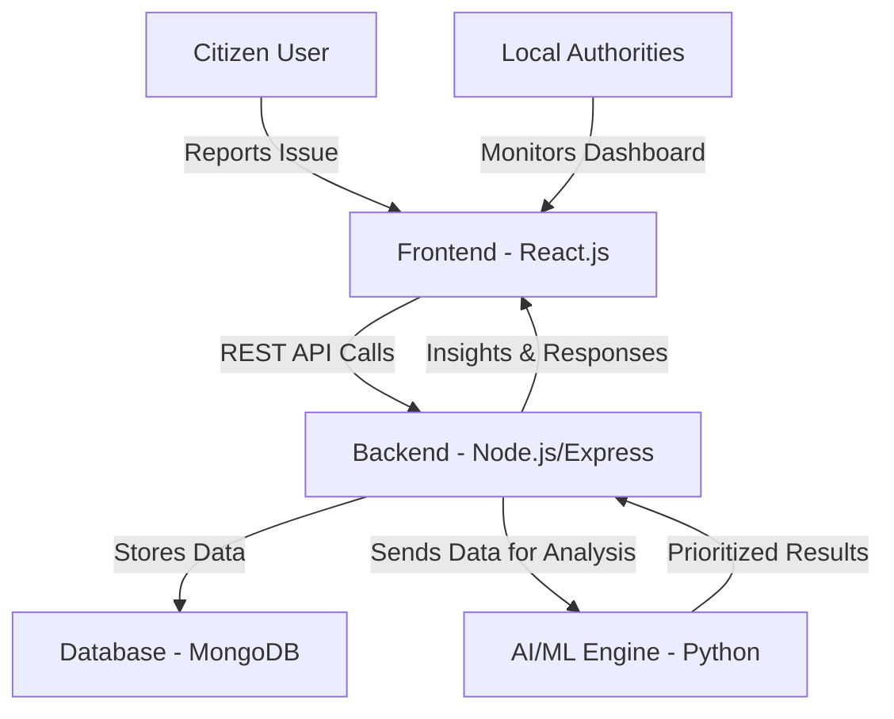

# 🌐 CivicConnect – AI Powered Civic Engagement Platform  

  
  
  
  
  
  

---

## 📖 Overview  
**CivicConnect** is a next-gen civic engagement platform designed to bridge the gap between **citizens and local authorities**. It enables **real-time issue reporting, transparent resolution tracking, and community collaboration** with the power of **AI and Gamification**.  

🚀 **Mission**: Empower communities to become smarter, safer, and more connected.  

---

## ✨ Features  

- **📌 Issue Reporting & Tracking** – Citizens can report civic issues (potholes, garbage, streetlights) with location & images.  
- **💬 Community Forums** – Engage in discussions on local events, development plans, and policies.  
- **🔔 Instant Alerts** – Get updates on road closures, weather warnings, or municipal notices.  
- **🤖 AI-Powered Prioritization** – Groups duplicate complaints, highlights urgent issues, and notifies relevant departments.  
- **🏆 Gamification** – Points, badges, and leaderboards encourage active citizen participation.  
- **📊 Dashboards & Insights** – Authorities can track trends, measure response times, and improve decision-making.  

---

## 🛠️ Tech Stack  

- **Frontend:** React.js, TailwindCSS  
- **Backend:** Node.js, Express.js  
- **Database:** MongoDB  
- **AI/ML:** Python (for incident clustering & prioritization), scikit-learn  

---

## 🏗️ Architecture  



---

## 🚀 Getting Started  

### 1. Clone the Repository  
```bash
git clone https://github.com/your-username/CivicConnect.git
cd CivicConnect
```

### 2. Install Dependencies  
```bash
npm install
```

### 3. Setup Environment  
Create a `.env` file in the root directory:  
```env
PORT=5000
MONGO_URI=your_mongodb_connection_string
JWT_SECRET=your_secret_key
```

### 4. Run the App  
```bash
npm run dev
```
Your app will be running at: **http://localhost:3000** 🎉  

---

## 📸 Screenshots (Optional)
*(Add images of your UI – issue reporting form, dashboard, forum view, etc.)*  

---

## 👨‍💻 Contributors  
- **Saketh Pinumalla** – Developer & Designer  

---

## 📜 License  
This project is licensed under the MIT License.  
